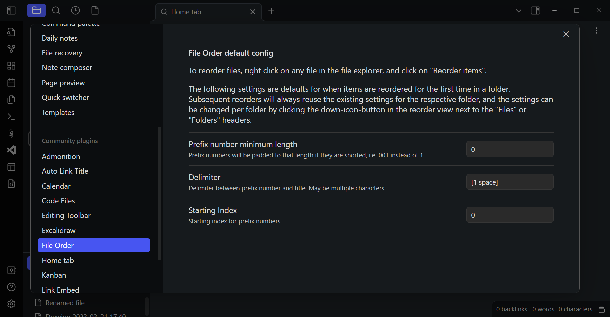
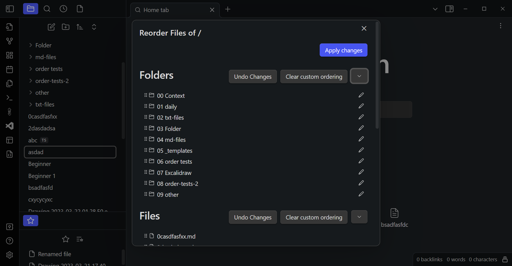
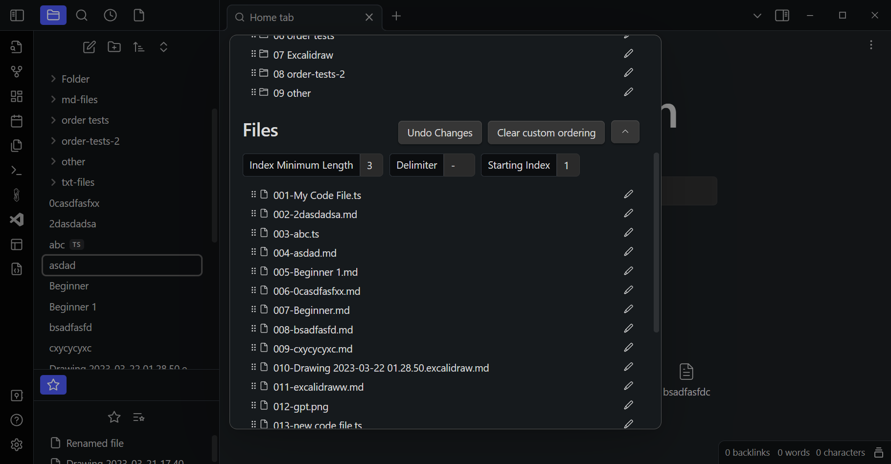

# File Order Obsidian Plugin

Use number-prefixes in your file names to define a custom order, and use drag-and-drop in the file explorer to update that order.

To use, after installation you can right-click on any folder or item and click
on "Reorder items" to open the reorder dialog. There, you can drag and drop items
to customize their order. By clicking in the down-arrow next to the "Files" or "Folders"
title, you can access additional options. There you can customize a minimum prefix length
(e.g. have all prefix numbers be at least 3 characters long), customize the delimiter
(a single space by default, but can be anything) or the starting index.

Reordering items will automatically update all references to any files you are reordering.

You can also always clear a custom ordering you made in the past, which will remove the 
prefixes from the file names and restore the default ordering.

When you open the reorder dialog another time in the future on a folder, which you have
customized before, the plugin will automatically infer these options from the set file names.
This means that the plugin maintains no settings itself, every ordering information used
is stored in the file names themselves, meaning you can continue to use the ordered files even
after you uninstall the plugin, and the plugin will also be able to read and allow you to edit
orderings you have created manually in the past.

In the plugin settings, you can also define default values for prefix length, delimiter and
starting index.


## Screenshots







## Contributing

To make changes to this plugin, first ensure you have the dependencies installed.

```
yarn
```

### Development

To start building the plugin with what mode enabled run the following command:

```
yarn dev
```

_Note: If you haven't already installed the hot-reload-plugin you'll be prompted to. You need to enable that plugin in your obsidian vault before hot-reloading will start. You might need to refresh your plugin list for it to show up._

### Releasing

To start a release build run the following command:

```
yarn build
```

---

<sub>This plugin was generated by (create-obsidian-plugin)[https://www.npmjs.com/package/create-obsidian-plugin]</sub>
